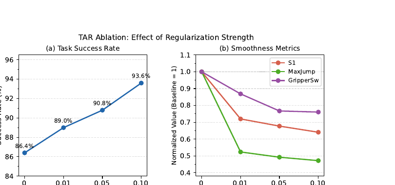
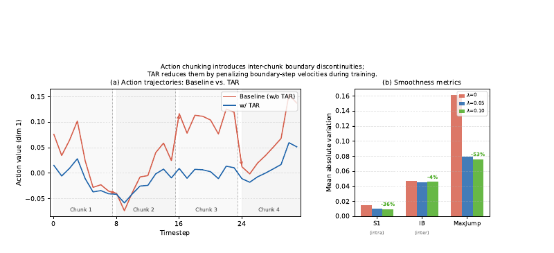
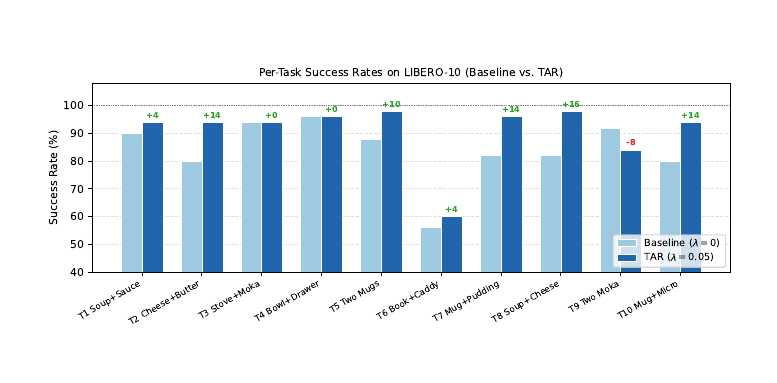
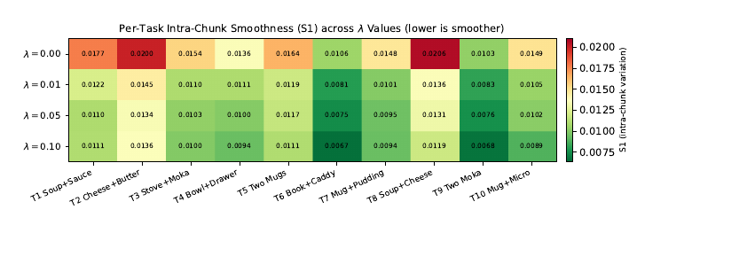

# TAR 课题进度全流程汇报

> **文档目标**：汇报 TAR 课题的完整科研过程与当前状态。  
> **汇报人**：何宁秋（Ningqiu He）  
> **文档日期**：2026-09-09  
> **代码与文档仓库**：`hnqhnq/robotic` monorepo → `bitvla-tar/`

---

## 文档导读

| 章节 | 内容 |
|------|------|
| §1 | 研究背景与动机 |
| §2 | 研究目标与核心贡献 |
| §3 | 方法概述（TAR） |
| §4 | 实验环境 |
| §5 | 实验数据 |
| §6 | 实验过程与时间线 |
| §7 | 实验结论 |
| §8 | 局限性与讨论 |
| §9 | 后续工作 |
| §10 | 计划投递 |
| §11 | 实验结果与资产缺失情况 |
| §12 | 复现计划与资源需求 |
| 附录 | 核心数据表 |

**相关文档**：

- 论文定稿：[`TAR-NingqiuHe.pdf`](TAR-NingqiuHe.pdf)
- 实验报告：[`20260401-实验报告.md`](20260401-实验报告.md) → v3 → v4

---

## 1. 研究背景与动机

### 1.1 领域背景

**Vision-Language-Action（VLA）模型**是当前机器人操作学习的主流范式：模型以 RGB 图像、本体感知状态和自然语言指令为输入，端到端预测机器人动作。代表性工作包括 OpenVLA、OpenVLA-OFT、BitVLA、π₀ 等。

现代 VLA 系统普遍采用 **Action Chunking（动作分块）**：模型每次前向推理预测未来 **T=8 步**动作序列（一个 chunk），机器人执行完后再请求下一个 chunk。该设计降低推理频率、缓解逐步误差累积，并支持短程规划。

### 1.2 问题发现

本课题以 **BitVLA**（1.58-bit 量化 VLA，3B 参数，推理显存约 1.4GB）为基座，在 **LIBERO-10** 长程桌面操作 benchmark 上复现并深入评估官方微调模型 `ft-bitvla-libero-long`（baseline）。

对 baseline 的完整 eval（500 episodes，含逐步动作记录）揭示：

| 指标 | 数值 | 含义 |
|------|------|------|
| 任务成功率 | **86.4%** | 500 次试验中 432 次成功 |
| S1（chunk 内平滑度） | 0.0154 | chunk 内部相邻步平均动作变化 |
| InterBoundary（IB，chunk 边界跳变） | **0.0477** | 相邻 chunk 衔接处平均跳变 |
| MaxJump（峰值跳变） | 0.1613 | chunk 内最大单步速度 |

**关键观察**：IB（0.0477）约为 S1（0.0154）的 **3.1 倍**，MaxJump 更是 S1 的 **10 倍以上**。问题不在单个 chunk 内部预测质量，而在于 **相邻 chunk 独立预测、训练目标未约束边界速度**，导致执行轨迹在 chunk 衔接处出现系统性不连续。

这与经典运动规划中的“边界速度约束”思想一致，但现有 VLA 训练通常只优化 L1 回归损失，不显式鼓励平滑过渡。推理侧缓解手段（如 temporal ensembling）会增加延迟与系统复杂度。

### 1.3 研究切入点

**能否在训练目标中直接约束 chunk 首尾速度，使相邻 chunk 自然对齐，且零推理开销？**

由此提出 **TAR（Temporal Action Regularization）**——在标准 L1 损失上增加一项轻量级边界速度惩罚，仅需约 5 行代码，不改变模型结构或推理流程。

### 1.4 选题与调研历程

| 时间 | 里程碑 |
|------|--------|
| 2026-03-15 | 完成 VLA 技术脉络调研，选定 BitVLA 为 baseline，确定“动作平滑 / chunk 边界”创新方向（见 `20260315.pdf`） |
| 2026-04-01 | 完成 TAR 机制设计；v1/v2 LoRA 方案失败分析，确立 v3 全参数微调方案 |
| 2026-04-18 | v3 主实验（λ=0.05）成功：90.8% 成功率 |
| 2026-05-04 | v4 四档消融完成：最优 93.6%（λ=0.10） |
| 定稿 | 论文 `TAR-NingqiuHe.pdf` 完成（7 页，IEEE 会议格式） |
| 2026-09 | 代码整理入库 `bitvla-tar/`；云 checkpoint 因实例释放丢失 |

---

## 2. 研究目标与核心贡献

### 2.1 研究目标

1. **提出** TAR：面向 action chunking VLA 的训练时边界速度正则化方法。
2. **验证** TAR 在 BitVLA + LIBERO-10 上同时提升任务成功率与动作平滑度。
3. **分析** 不同正则强度 λ 对成功率与多维度平滑指标的影响，给出超参数建议。
4. **论证** TAR 的双重机制：直接轨迹平滑 + 隐式泛化正则。

### 2.2 核心贡献

| # | 贡献 | 证据 |
|---|------|------|
| C1 | **轻量、零推理开销**的正则项，~5 行代码即可集成任意 chunk-based VLA 训练 | `finetune_bitnet.py` 实现；训练步开销 <0.1ms |
| C2 | **显著成功率提升**：86.4% → 93.6%（+7.2 pp，λ=0.10） | v4 消融 + 500-episode eval |
| C3 | **全面平滑度改善**：S1 −36%，MaxJump −53%，GripperSwitches −24% | 四档 λ 消融 |
| C4 | **四档消融单调性**：λ ∈ {0, 0.01, 0.05, 0.10} 成功率与多数平滑指标随 λ 单调改善 | Table IV / 实验报告 |
| C5 | **双重机制分析**：直接平滑 + 训练 loss 与 eval 性能“倒挂”的泛化正则效应 | λ=0.10 训练 loss 最高但 eval 最优 |

本论文的创新主要体现在三个层面：

（1）问题层面，在 BitVLA baseline 评估中发现 chunk 边界跳变是动作不平滑的主因；

（2）方法层面，提出轻量级 TAR 正则项，仅修改训练目标、不改变推理流程；

（3）实证层面，在 LIBERO-10 上通过完整消融验证有效性与可迁移潜力。

方法性质上接近“可插拔的训练技巧”，而非 backbone 或系统级重构；优势在于简洁、通用、易集成到其他 chunk-based 策略学习框架。

---

## 3. 方法概述（TAR）

### 3.1 问题形式化

给定观测 \(o_t\) 与语言指令 \(\ell\)，VLA 预测动作 chunk：

\[
\hat{a}_{t:t+T} \in \mathbb{R}^{T \times D}, \quad D=7 \text{（6-DoF 末端增量 + 夹爪）}
\]

标准训练最小化 L1 损失 \(\mathcal{L}_{\text{L1}}\)，但对 chunk 首尾步速度无额外约束。

### 3.2 TAR 损失

\[
\mathcal{L} = \mathcal{L}_{\text{L1}} + \lambda_{\text{TAR}} \cdot \mathcal{L}_{\text{TAR}}
\]

\[
\mathcal{L}_{\text{TAR}} = \frac{1}{BD} \sum_{b,d} \Big( |\hat{a}_{b,1,d} - \hat{a}_{b,0,d}| + |\hat{a}_{b,T-1,d} - \hat{a}_{b,T-2,d}| \Big)
\]

**直觉**：每个 chunk“慢启动、慢结束”，相邻 chunk 在边界处自然对齐；无需修改数据管线或推理逻辑。

### 3.3 设计选择（简要）

- **只惩罚边界步**（非全 chunk 均匀平滑）：保留 chunk 内部快速运动的表达能力。
- **不直接惩罚 inter-chunk jump**：避免需要配对相邻 chunk 的复杂数据加载。
- **L1 边界惩罚**：与主损失一致，对离群高速步更鲁棒。

## 4. 实验环境

### 4.1 硬件

| 阶段 | 配置 |
|------|------|
| **训练** | 4 × NVIDIA GeForce RTX 4090D（24GB），FSDP（FULL_SHARD）+ gradient checkpointing |
| **评估** | 1 × RTX 4090D（24GB） |
| **显存占用** | 训练约 15GB/卡；BitVLA 推理约 1.4GB |

> v3 因 4×24GB 无法用 DDP 跑全参数微调，改用 FSDP + gradient checkpointing；effective batch、学习率等与 baseline 对齐，仅分布式策略不同。

### 4.2 软件栈

| 组件 | 说明 |
|------|------|
| 基座模型 | BitVLA（`bitvla-bf16`，HuggingFace: `lxsy/bitvla-bf16`） |
| 训练框架 | 修改版 `transformers` + `openvla-oft/bitvla`（BitVLA fork + TAR 补丁） |
| 分布式 | `accelerate` + FSDP |
| 仿真环境 | LIBERO + robosuite（MuJoCo） |
| 操作系统 | Linux（云 GPU 实例，Autodl 等） |

### 4.3 训练超参数（v3/v4 统一，唯一变量为 λ）

| 参数 | 值 |
|------|-----|
| 数据集 | `libero_10_no_noops` |
| max_steps | 10,001 |
| effective batch | 64（bs=2 × accum=8 × 4 卡） |
| learning_rate | 4e-4（ViT: 8e-5） |
| image_aug | True |
| gradient_checkpointing | True |
| chunk 长度 T | 8 |
| **tar_lambda** | **0 / 0.01 / 0.05 / 0.10**（消融变量） |

### 4.4 评估协议

| 参数 | 值 |
|------|-----|
| Benchmark | LIBERO-10（10 个长程任务） |
| 每任务 trials | 50 |
| 总 episodes | 500 / 模型 |
| 成功判定 | 固定步数预算内完成全部子目标 |
| 附加指标 | S1, S2, MaxJump, IB, GripperSwitches 等（eval 时从预测 chunk 聚合） |

---

## 5. 实验数据

### 5.1 训练数据

| 数据集 | 来源 | 规模 | 本地路径 |
|--------|------|------|----------|
| LIBERO-10 RLDS | HuggingFace `openvla/modified_libero_rlds` | 演示轨迹（无 no-op 过滤版） | `data/modified_libero_rlds/` |

**说明**：训练使用 `libero_10_no_noops` split；需 `dataset_statistics.json` 做动作反归一化（eval 时常见报错点，见 v3 报告第四节 checkpoint 修复）。

### 5.2 预训练与 Baseline 权重

| 资产 | 来源 | 用途 |
|------|------|------|
| `bitvla-bf16` | `lxsy/bitvla-bf16` | 所有 TAR 训练的起点 |
| `ft-bitvla-libero-long` | `hongyuw/ft-bitvla-bitsiglipL-224px-libero_long-bf16` | Baseline（λ=0）参考；可选直接 eval |

### 5.3 实验产出数据（原始记录状态）

| 产出 | 内容 | 当前状态 |
|------|------|----------|
| 训练 checkpoint | 各 λ 的 10000 步权重 | ❌ 云实例释放后丢失 |
| 训练 log / TensorBoard | loss、tar_loss 曲线 | ❌ 丢失（关键采样点已写入实验报告） |
| eval 轨迹 / smoothness.json | 逐步动作与 Fig.1 左侧轨迹 | ❌ 丢失 |
| 实验报告 + 论文表格 | 汇总数值 | ✅ 完整保留 |
| 定稿 PDF | 全部表格与插图 | ✅ 完整保留 |

> **数据可信度**：论文与实验报告中的数值来自当时完整 eval 的汇总，不依赖现存 checkpoint；丢失的主要是**可复现运行的权重**和**原始中间文件**。

---

## 6. 实验过程与时间线

### 6.1 实验演进路线

```text
Baseline eval（86.4%）
    → 发现 chunk 边界跳变问题（IB ≈ 3× S1）
    → 设计 TAR loss
    → v1/v2 LoRA 失败（方法论不一致，非 TAR 无效）
    → v3 全参数微调 + FSDP（λ=0.05）→ 90.8%
    → v4 消融 λ=0.01, 0.10 → 完整四点曲线，最优 93.6%
    → 论文定稿
    → 代码整理入库 bitvla-tar/
```

### 6.2 v1/v2 失败经验（方法探索）

| 方案 | 成功率 | 结论 |
|------|--------|------|
| v1-notar | 1.5% | base + LoRA 1000 步，训练量严重不足 |
| v2-notar | 22.0% | 已收敛模型 + LoRA，灾难性干扰 |
| v2-tar | 48.0% | 绝对值低，但 TAR 相对 v2-notar 提升显著（22%→48%），证明正则方向正确 |

**教训**：必须与 baseline 对齐训练范式（全参数微调、10001 步、相同 batch/lr），**唯一变量为 TAR**。

### 6.3 v3 主实验（2026-04-18，λ=0.05）

| 项目 | 详情 |
|------|------|
| 训练时长 | ~45h 40min（~17 s/step） |
| 最终 loss | 0.0746；tar_loss ≈ 0.0009 |
| Eval 时长 | ~11h（500 episodes） |
| 结果 | 成功率 **90.8%**（+4.4 pp）；S1 −32%，MaxJump −51% |
| 工程问题 | FSDP checkpoint 需 3 步修复方可 eval（statistics / tokenizer / projector 链接） |

### 6.4 v4 消融（2026-05-04，λ=0.01 & 0.10）

| 组别 | 训练时间 | 最终 loss | Eval 成功率 |
|------|----------|-----------|-------------|
| 消融 A（λ=0.01） | ~40h | ~0.076 | **89.0%** |
| v3 参考（λ=0.05） | ~45h | 0.0746 | **90.8%** |
| 消融 B（λ=0.10） | ~40h | ~0.085 | **93.6%** |

- 训练：4/29–5/03，合计 ~80h  
- Eval：5/03–5/04 串联 eval，合计 ~23h  
- **总 GPU 时间**：约 200+ GPU·h（含 baseline eval 与 v3）

### 6.5 评估指标定义（汇报时可简述）

| 指标 | 定义 | 方向 |
|------|------|------|
| **Success Rate** | 500 episodes 成功比例 | ↑ 越高越好 |
| **S1** | chunk 内逐步平均绝对速度 | ↓ |
| **S2** | chunk 内二阶变化 | ↓ |
| **MaxJump** | chunk 内峰值单步速度 | ↓ |
| **InterBoundary (IB)** | 相邻 chunk 边界跳变 | ↓ |
| **GripperSwitches** | 每 chunk 夹爪切换次数 | ↓ |

---

## 7. 实验结论

### 7.1 主结果（四点消融汇总）

| λ_TAR | 成功率 | Δ vs Baseline | S1 ↓ | MaxJump ↓ | IB ↓ | GripperSw ↓ |
|-------|--------|---------------|------|-----------|------|-------------|
| 0.00 | 86.4% | — | 0.0154 | 0.1613 | 0.0477 | 0.572 |
| 0.01 | 89.0% | +2.6 pp | 0.0111 | 0.0844 | **0.0421** | 0.497 |
| 0.05 | 90.8% | +4.4 pp | 0.0104 | 0.0794 | 0.0451 | 0.439 |
| 0.10 | **93.6%** | **+7.2 pp** | **0.0099** | **0.0761** | 0.0460 | **0.435** |

**Fig.3 — λ 消融曲线**（对应上表四点数据）



- **左图**：成功率随 λ 单调上升（86.4% → 93.6%），在 λ=0.10 达到最优，测试范围内无性能拐点。
- **右图**：S1、MaxJump 等平滑指标随 λ 同步改善；IB 在 λ=0.01 最低（见 §7.4 非单调说明）。
- **要点**：λ 越大 → 成功率与 chunk 内平滑度越好。

---

### 7.2 关键结论（5 条）

1. **TAR 有效且安全**：在 λ ≤ 0.10 范围内未观察到成功率拐点或性能下降。
2. **λ=0.10 为当前最优**：成功率 93.6%，较 v3（λ=0.05）再 +2.8 pp。

3. **平滑度全面改善**：相对 baseline，S1 −36%，MaxJump −53%，GripperSwitches −24%。

**Fig.1 — 问题动机与平滑度改善概览**（论文 Fig.1）



- **左图**：相邻 chunk 衔接处，baseline（红）易出现速度跳变；TAR（蓝）轨迹更连贯。**说明**：左图为定稿 PDF 中的示意曲线（原始 eval 轨迹文件已丢失，与投稿版一致）。
- **右图**：S1、IB、MaxJump 随 TAR 强度下降；百分比为相对 baseline（λ=0）的降幅，与 §7.1 中 λ=0.05 一行的数值对应。
- **要点**：直观说明“问题在 chunk 边界“以及“TAR 同时改善多项平滑指标“。

4. **9/10 任务提升或持平**：多物体精细放置类任务增益最大（+10%～+16%）；仅 Task 9（双摩卡壶上灶）略降 8%。

**Fig.2 — 逐任务成功率**（论文 Fig.2，λ=0 vs λ=0.05）



- 绿/红标注为 TAR 相对 baseline 的**绝对变化**（百分点）。
- **提升最大**：Task 2、5、7、8、10（多物体精细放置，+10%～+16%）。
- **持平**：Task 3、4（baseline 已在 94%～96%，提升空间有限）。
- **唯一下降**：Task 9（双摩卡壶上灶，−8%）；汇报时可主动说明，避免导师追问时被动。

5. **双重机制**：TAR 同时作为边界平滑算子与隐式正则项——λ=0.10 训练 loss 最高但 eval 最优，符合泛化正则特征。

**Fig.4 — 逐任务 S1 热力图**（论文 Fig.4，四点 λ 完整对比，可选细读）



- 颜色越深（绿）表示 S1 越低、轨迹越平滑。
- 多数任务 S1 随 λ 增大而下降，说明平滑改善**不依赖任务难度**，具有任务无关性。
- 可与 §7.2 第 4 条对照：成功率涨得多的任务，S1 通常也降得更明显。

### 7.3 超参数建议

| 场景 | 推荐 λ |
|------|--------|
| 保守默认 | 0.05（v3 已验证，+4.4 pp，性价比较高） |
| 追求最高成功率 | 0.10（当前实验最优） |
| 论文报告区间 | **[0.05, 0.10]** |

### 7.4 非单调现象

**InterBoundary** 在 λ=0.01 时最低（0.0421），λ 增大后略回升至 0.0460。解释：更强的 chunk 内速度约束可能使模型在边界处做短暂“修正跳变”。但成功率与 S1、MaxJump 仍随 λ 单调改善，说明 **chunk 内平滑对任务完成的影响大于 IB 单项**。

> 参见 **Fig.3 右图** 与 §7.1 表格 IB 列：IB 在 λ=0.01 处最低，λ≥0.05 后略回升，而成功率与 S1、MaxJump 仍随 λ 单调改善。

---

## 8. 局限性与讨论

| 局限 | 说明 |
|------|------|
| 单一 benchmark | 仅在 LIBERO-10 上验证；Spatial / Object / Long 子集未测 |
| 单一 backbone | 仅 BitVLA；OpenVLA-OFT、π₀ 等待验证 |
| 仿真环境 | 无真实机器人实验；平滑度改善的物理效果未直接验证 |
| λ 上界未知 | 消融在 0.10 处无饱和；更大 λ（0.2、0.5）未探索 |
| Baseline 训练细节 | v3 使用 FSDP 而非 baseline 的 DDP；已论证等价性，但严格复现可能有 ±1–3 pp 波动 |
| Fig.1 左侧轨迹 | 定稿中为示意曲线；原始 eval 轨迹已丢失（与 PDF 一致） |

---

## 9. 后续工作

### 9.1 短期

| 优先级 | 任务 | 目的 |
|--------|------|------|
| P0 | 在 GPU 服务器上**复现 λ=0.10**（L1 最低成本路径） | 恢复可加载 checkpoint，支撑审稿 rebuttal |

其他缺失模型和数据复现。

### 9.2 中期（论文修订 / 审稿阶段）

- **扩展 benchmark**：LIBERO-Spatial、Object、Long
- **跨模型验证**：OpenVLA-OFT、SmolVLA 等 chunk-based VLA
- **λ 扩展消融**：0.2、0.5，寻找饱和点
- **Per-task 四点对比**：识别 TAR 最敏感任务类型
- **插图矢量源文件**：若期刊要求可编辑图，用 eval 数据重绘或找回原始工程

### 9.3 长期

- **真实机器人部署**：验证平滑度对硬件执行的实际收益【有真机验证可考虑投递较高等级但是难度会增大】
- **自适应 λ schedule**：训练过程中动态调节正则强度【要快速投递可先不考虑】
- **直接边界配对损失**：相邻 chunk 联合训练，更强 IB 约束（代价是数据管线复杂度）【复杂度较高暂时不考虑】

---

## 10. 计划投递

### 10.1 当前稿件状态

| 项目 | 状态 |
|------|------|
| 定稿 PDF | ✅ `doc/TAR-NingqiuHe.pdf` |
| LaTeX 源码 | ✅ `doc/paper/`（由 PDF 反推重建，可编译，但是部分结果数据丢失需要重新运行实验） |

### 10.2 候选投递方向（需要讨论）

论文内容（VLA + 机器人操作 + 轻量训练正则）与以下 **IEEE 会议**方向较为匹配：

| 类型 | 候选 venue | 匹配点 |
|------|------------|--------|
| 机器人旗舰 | **ICRA**、**IROS** | 操作学习、sim benchmark、实用训练技巧 |
| 机器人学习 | **CoRL**（非 IEEE，但领域高度相关） | VLA / policy learning |
| 综合 AI | **AAAI**、**IJCAI** | 若强调通用 ML 正则化视角 |

> **需要讨论：**首选会议、投稿时间窗口、是否需补充实验（如实机 / 跨模型）以满足目标 venue 要求**。

## 11. 实验结果与资产缺失情况

### 11.1 结果本身：未缺失

以下**数值结论完整可信**，存档定稿 PDF 与 v3/v4 实验报告：

- 四点消融表（成功率 + 5 项平滑指标）
- Per-task 成功率（10 任务 × 4 λ）
- 训练 loss 采样点与 tar_loss 收敛曲线（摘要级）
- 论文全部 6 张表 + 4 幅图（定稿 PDF 保留）

### 11.2 已丢失（云环境清理）

| 丢失项 | 影响 | 可恢复性 |
|--------|------|----------|
| 全部训练 checkpoint | 无法直接加载推理 / 继续训练 | 需重新训练（~40h/模型） |
| TensorBoard / 完整训练 log | 无法绘制精确 loss 曲线 | 报告中有采样点；可重训记录 |
| eval 原始轨迹、smoothness.json | 无法从原始 rollout 重绘 Fig.1 左图 | 定稿 PDF 已裁剪保留；需重 eval 方可获得新轨迹 |
| 云 GPU 完整 Python 环境 | 不能一键复现 | 按 REPRODUCE.md 重建 |

### 11.3 部分缺失 / 待补全

| 项目 | 现状 | 下一步 |
|------|------|--------|
| `bitvla-bf16` 权重 | Git LFS 占位符（~372KB） | `bash scripts/download_models.sh` |
| LIBERO 数据 | monorepo `src/data/` 约 3.5GB，未链接到 `bitvla-tar/data/` | `scripts/link_local_assets.sh` 或 `download_data.sh` |
| 论文插图矢量源 | 原始 `.eps`/`.fig` 丢失 | 方案 B：从定稿 PDF 裁剪（已采用）；备选 `generate_figures.py` |
| 端到端复现验证 | 代码已入库，未在新环境完整跑通 | 需 4×24GB GPU 服务器 |

### 11.4 当前保留的核心资产

| 类别 | 位置 |
|------|------|
| 论文定稿 | `doc/TAR-NingqiuHe.pdf` |
| 实验报告（v1→v4） | `doc/20260401/0418/0504-实验报告.md` |
| TAR 完整代码 | `openvla-oft/`, `scripts/` |
| LaTeX + 重建插图 | `doc/paper/` |

---

## 12. 复现计划与资源需求

### 12.1 分阶段计划

| 阶段 | 内容 | 预估时间 |
|------|------|----------|
| Phase 0 | 环境搭建 + 下载权重/数据 | 0.5–1 天 |
| Phase 1 | Smoke test（100 step）+ GPU 验证 | 0.5 天 |
| Phase 2（L1 最低成本） | 仅训 λ=0.10 + eval | ~2 天训练 + ~11h eval |
| Phase 3（L3 完整） | v3 + v4 四档消融 | ~1–2 周 GPU 时间 |

### 12.2 GPU 预算参考

| 路径 | 训练 | 评估 | 合计 |
|------|------|------|------|
| L1（baseline eval + λ=0.10） | ~40h | ~22h | ~55–65 GPU·h |
| L2（+ λ=0.05） | +40h | +11h | ~105 GPU·h |
| L3（Table IV 四点完整） | ~120h | ~44h | **200+ GPU·h** |

---

## 附录 A：Per-Task 成功率（λ=0 vs λ=0.10）

| Task | Baseline | TAR (λ=0.10) | Δ |
|------|----------|--------------|---|
| 1. alphabet soup + tomato sauce → basket | 90% | 94% | +4% |
| 2. cream cheese + butter → basket | 80% | 94% | +14% |
| 3. turn on stove + moka pot | 94% | 94% | 0% |
| 4. black bowl → drawer | 96% | 96% | 0% |
| 5. white mug left + yellow mug right | 88% | 98% | +10% |
| 6. book → caddy | 56% | 60% | +4% |
| 7. mug on plate + pudding right | 82% | 96% | +14% |
| 8. soup + cream cheese → basket | 82% | 98% | +16% |
| 9. both moka pots on stove | 92% | 84% | −8% |
| 10. yellow mug → microwave | 80% | 94% | +14% |

