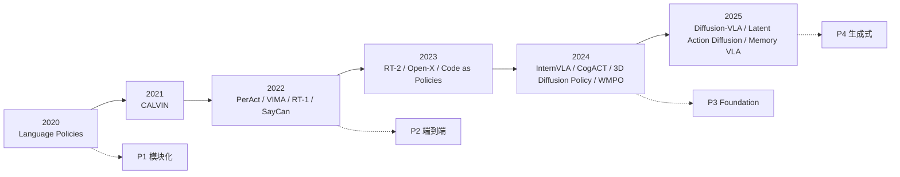
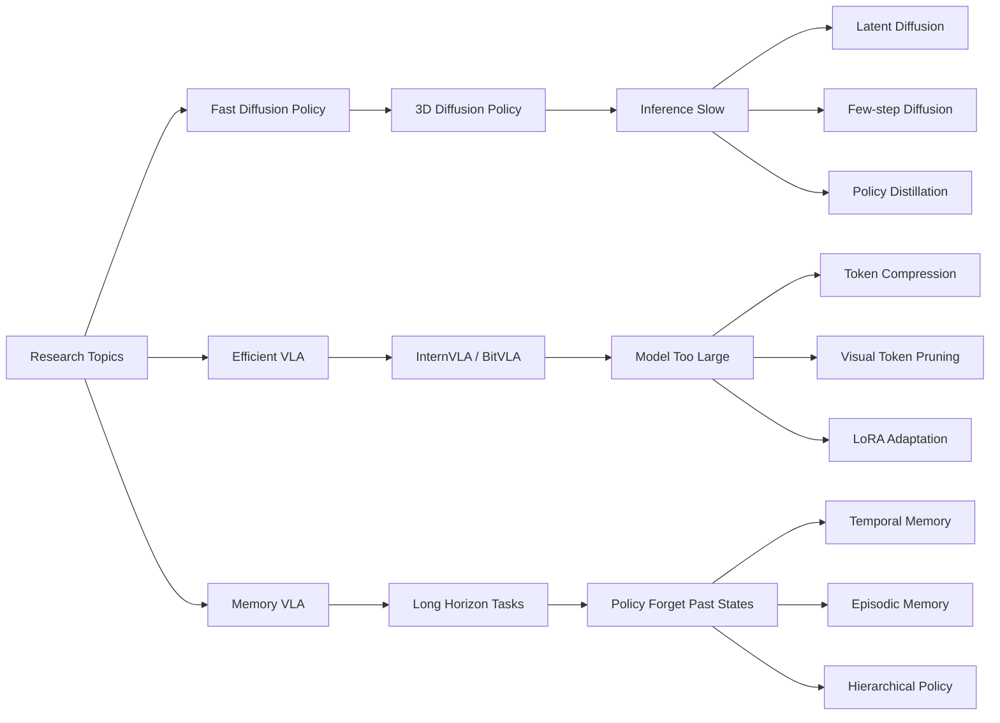
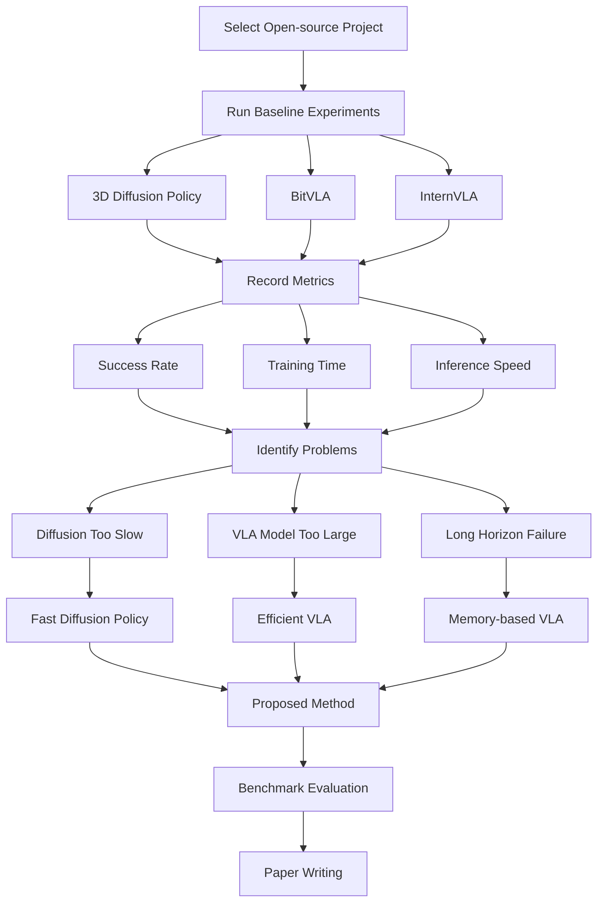
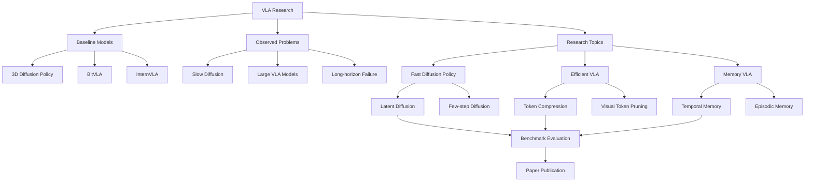

# VLA 开源项目调研与潜在论文方向（组会汇报草稿）

## 一、调研目标

根据导师建议： - 寻找 **最新开源代码** - 进行 **实验复现** - 分析
**现有方法的问题** - 提出 **改进方法** - 形成 **论文创新点**

本报告整理了 **当前
Vision-Language-Action（VLA）领域最适合开展研究与论文创新的10个开源项目**，并给出潜在研究方向。

------------------------------------------------------------------------

# 二、筛选标准

筛选项目主要依据以下标准：

1.  **2023--2025 最新研究**
2.  **存在可复现代码**
3.  **社区关注度较高**
4.  **存在明显研究问题**
5.  **算力要求可控**

------------------------------------------------------------------------

# 三、最适合论文研究的10个开源项目

## （一）Diffusion / 生成式策略方向

### 1. 3D Diffusion Policy ⭐⭐⭐⭐⭐

GitHub\
https://github.com/YanjieZe/3D-Diffusion-Policy

论文\
https://arxiv.org/pdf/2403.03954

研究方向\
Visuomotor Diffusion Policy

优点：

-   2024 最新机器人 diffusion 代表方法
-   关注度高
-   开源代码完整
-   可在 RLBench / CALVIN 上实验

潜在问题：

-   推理速度慢
-   长时序任务稳定性不足
-   训练成本较高

可研究创新：

-   Fast Diffusion Policy
-   Latent Action Diffusion
-   Hierarchical Diffusion Policy

------------------------------------------------------------------------

### 2. Diffusion-VLA

研究方向：

VLM + Diffusion Action Policy

潜在研究问题：

-   多模态融合策略
-   Action tokenization
-   视觉语言对动作生成的影响

------------------------------------------------------------------------

### 3. Discrete Diffusion VLA

GitHub\
https://github.com/Liang-ZX/DiscreteDiffusionVLA

特点：

离散动作 Diffusion Policy

研究空间：

-   连续动作 vs 离散动作建模
-   Diffusion 控制稳定性
-   Action token设计

------------------------------------------------------------------------

# （二）Foundation VLA 方向

### 4. InternVLA ⭐⭐⭐⭐⭐

GitHub\
https://github.com/InternRobotics/InternVLA-M1

研究方向

Foundation Vision-Language-Action Model

优点：

-   2024 新提出的通用机器人模型
-   结构清晰
-   研究空间大

问题：

-   数据需求大
-   推理成本高

创新方向：

-   Efficient VLA
-   Memory VLA
-   Small-scale VLA

------------------------------------------------------------------------

### 5. CogACT

GitHub

https://github.com/microsoft/CogACT

特点：

Cognition + Action

研究空间：

-   reasoning for manipulation
-   planning + policy integration

------------------------------------------------------------------------

# （三）VLA结构改进方向

### 6. BitVLA ⭐⭐⭐⭐

GitHub

https://github.com/ustcwhy/BitVLA

特点：

轻量级 VLA

优点：

-   模型规模较小
-   易于复现
-   实验成本低

创新方向：

-   Efficient representation
-   Action token compression

------------------------------------------------------------------------

### 7. MemoryVLA

GitHub

https://github.com/shihao1895/MemoryVLA

研究方向：

引入记忆机制的 VLA

研究问题：

-   long-horizon manipulation

创新空间：

-   episodic memory
-   temporal memory

------------------------------------------------------------------------

### 8. HiMoE-VLA

GitHub

https://github.com/ZhiyingDu/HiMoE-VLA

研究方向：

Mixture of Experts VLA

创新空间：

-   task routing
-   expert selection
-   skill modularization

------------------------------------------------------------------------

# （四）World Model / Planning 方向

### 9. WMPO

GitHub

https://github.com/WM-PO/WMPO

研究方向：

World Model Policy Optimization

问题：

-   训练复杂
-   计算成本高

研究空间：

-   高效 world model
-   planning horizon optimization

------------------------------------------------------------------------

# （五）经典多模态策略

### 10. VIMA

GitHub

https://github.com/vimalabs/VIMA

论文：

VIMA: General Robot Manipulation with Multimodal Prompts

研究空间：

-   Prompt learning
-   Task representation

------------------------------------------------------------------------

# 四、最推荐优先实验的3个项目

若时间有限，建议优先复现以下三个：

  项目                  研究价值     算力需求
--------------------- ------------ ----------
  3D Diffusion Policy   ⭐⭐⭐⭐⭐   中
  BitVLA                ⭐⭐⭐⭐     低
  InternVLA             ⭐⭐⭐⭐     中

原因：

-   覆盖 **生成式策略 / 轻量模型 / Foundation模型**
-   可形成系统性对比实验

------------------------------------------------------------------------

# 五、潜在论文研究方向

## 1 Action Representation

研究方向：

-   Continuous Action
-   Latent Action
-   Action Tokens

------------------------------------------------------------------------

## 2 Long-Horizon Manipulation

研究问题：

-   长时序任务稳定性
-   任务分解能力

------------------------------------------------------------------------

## 3 Efficient VLA

当前问题：

-   模型规模过大
-   推理速度慢
-   训练成本高

潜在研究：

-   Small VLA
-   Fast VLA
-   Efficient policy

------------------------------------------------------------------------

# 六、建议的研究路线

## 第一阶段（复现）

复现项目：

-   3D Diffusion Policy
-   BitVLA

目标：

-   跑通代码
-   成功复现 demo

------------------------------------------------------------------------

## 第二阶段（benchmark实验）

在统一 benchmark 上评测：

-   RLBench
-   CALVIN

记录指标：

-   Success Rate
-   Training Time
-   Inference Speed

------------------------------------------------------------------------

## 第三阶段（问题分析）

分析不同方法的优缺点：

  方法               优点           缺点
------------------ -------------- ------------
  BC Policy          推理快         泛化差
  Transformer VLA    泛化强         数据需求大
  Diffusion Policy   长时序能力强   推理慢

------------------------------------------------------------------------

## 第四阶段（方法改进）

提出改进方法，例如：

-   Efficient Action Representation
-   Fast Diffusion Policy
-   Memory-based VLA

------------------------------------------------------------------------

# 七、预期论文方向示例

Potential Paper Topic:

Efficient Vision-Language-Action Policies for Long-Horizon Robot
Manipulation

实验对比：

  方法               Success Rate   Inference Speed
------------------ -------------- -----------------
  BitVLA                            
  InternVLA                         
  Diffusion Policy                  
  Proposed Method                   

# 八、路线图

# 九、研究选题图

研究选题详细结构图

研究流程图

总览图

# 十、VLA复现项目实验计划表

| 项目名称                    | GitHub 地址                                                                                          | 论文地址                                                                               | 方法类型                  | 核心技术描述                                                                                                         | 推荐 Benchmark     | 算力需求                           | 复现难度 | 潜在研究问题                                 |
| ----------------------- | -------------------------------------------------------------------------------------------------- | ---------------------------------------------------------------------------------- | --------------------- | -------------------------------------------------------------------------------------------------------------- | ---------------- | ------------------------------ | ---- | -------------------------------------- |
| **3D Diffusion Policy** | [https://github.com/YanjieZe/3D-Diffusion-Policy](https://github.com/YanjieZe/3D-Diffusion-Policy) | [https://arxiv.org/pdf/2403.03954](https://arxiv.org/pdf/2403.03954)               | Generative Policy（P4） | 使用 **Diffusion Model** 生成机器人动作轨迹，通过 3D 表征（point cloud / voxel）进行 visuomotor policy learning，适用于复杂 manipulation | RLBench / CALVIN | 1–2 × RTX3090 / 4090（训练）；推理可单卡 | ⭐⭐⭐  | 推理速度慢；长时序任务稳定性；action diffusion step优化 |
| **BitVLA**              | [https://github.com/ustcwhy/BitVLA](https://github.com/ustcwhy/BitVLA)                             | [https://arxiv.org/pdf/2506.07530](https://arxiv.org/pdf/2506.07530) | Efficient VLA（P3）     | 轻量级 Vision-Language-Action 模型，通过 **token压缩和高效表示**降低模型规模，使VLA可在较小算力环境运行                                         | RLBench / Open-X | 1 × RTX3090 / 4090             | ⭐⭐   | action token设计；视觉token压缩；小模型泛化能力       |
| **InternVLA-M1**        | [https://github.com/InternRobotics/InternVLA-M1](https://github.com/InternRobotics/InternVLA-M1)   | [https://arxiv.org/abs/2403](https://arxiv.org/abs/2403).????                      | Foundation VLA（P3）    | 通用机器人模型架构：视觉编码器 + 语言编码器 + multimodal transformer + action head，强调 **跨任务泛化能力**                                  | Open-X / CALVIN  | 2–4 × RTX4090 或 A100           | ⭐⭐⭐⭐ | 模型规模过大；推理效率；数据需求；small-VLA设计           |

对比

| 方法                | 类型              | 核心思想              | 优点         | 缺点         |
| ------------------- | ----------------- | --------------------- | ------------ | ------------ |
| 3D Diffusion Policy | Generative Policy | diffusion生成动作序列 | 长时序建模强 | 推理慢       |
| BitVLA              | Efficient VLA     | 轻量级VLA模型         | 算力需求低   | 表达能力有限 |
| InternVLA           | Foundation VLA    | 大规模多模态模型      | 泛化能力强   | 训练成本高   |

复现顺序

| 顺序 | 项目                    | 原因                   |
| ---- | ----------------------- | ---------------------- |
| ①    | **BitVLA**              | 模型最小，最快跑通     |
| ②    | **3D Diffusion Policy** | 生成式策略研究价值高   |
| ③    | **InternVLA**           | Foundation模型结构复杂 |

实验记录表设计

| 实验编号 | 模型             | Benchmark | Success Rate | Training Time | Inference Speed |
| -------- | ---------------- | --------- | ------------ | ------------- | --------------- |
| Exp-1    | BitVLA           | RLBench   |              |               |                 |
| Exp-2    | Diffusion Policy | RLBench   |              |               |                 |
| Exp-3    | InternVLA        | CALVIN    |              |               |                 |

# 服务器情况

https://www.autodl.com/market/list

预设：

GPU        RTX3090
CPU        8核
内存       32GB
镜像       PyTorch 2.1 CUDA11.8
系统       Ubuntu22
数据盘     100GB

**当前服务器配置**（实际）

- GPU：RTX 4090D 24GB（1卡）
- CPU：16 vCPU Xeon 8481C
- 内存：80GB
- 系统：Ubuntu 22.04
- Python：3.10
- PyTorch：2.1.0
- CUDA：12.1
- 数据盘：50GB
- 价格：1.88 元/小时

目录说明:
╔═════════════════╦════════╦════╦═════════════════════════════════════════════════════════════════════════╗
║目录             ║名称    ║速度║说明                                                                     ║
╠═════════════════╬════════╬════╬═════════════════════════════════════════════════════════════════════════╣
║/                ║系 统 盘║一般║实例关机数据不会丢失，可存放代码等。会随保存镜像一起保存。               ║
║/root/autodl-tmp ║数 据 盘║ 快 ║实例关机数据不会丢失，可存放读写IO要求高的数据。但不会随保存镜像一起保存 ║
╚═════════════════╩════════╩════╩═════════════════════════════════════════════════════════════════════════╝
CPU ：16 核心
内存：80 GB
GPU ：NVIDIA GeForce RTX 4090 D, 1
存储：
  系 统 盘/               ：1% 53M/30G
  数 据 盘/root/autodl-tmp：1% 12K/50G

**项目1：**

/root/autodl-tmp/project/code/BitVLA

# VLA 研究主线地图

论文开头必须提到的主线。

RT-2（2023）
代表意义：把 VLM/VLA 概念真正打响，强调“把网络知识迁移到机器人控制”。论文在 arXiv 公开，但不是你现在最适合复现的对象。

OpenVLA（2024）
代表意义：开源 VLA baseline，7B 参数、970k real-world demos，是目前很多开源工作对齐和比较的核心对象。官方论文与官方 GitHub 都公开。

BitVLA（2025）
代表意义：把“原生低比特 VLA”推到台前，主打 1-bit / 1.58-bit 部署友好路线。官方论文与官方代码都公开。

SmolVLA（2025）
代表意义：小模型、低成本、社区数据、消费级硬件部署，是另一条很强的轻量化路线。官方博客、文档和代码都在 Hugging Face / LeRobot 体系里。

## 论文清单

### 第一组：必须精读

这组认真读。

RT-2 (2023)：VLA 概念标志性论文。

OpenVLA (2024)：开源强 baseline。

BitVLA (2025)：你的当前主线。

SmolVLA (2025)：轻量化另一核心参照。

### 第二组：和你未来创新高度相关

这组不用第一时间复现，但一定要做笔记。

FAST：动作高效 tokenization。

VQ-VLA：向量量化动作 tokenizer。

ActDistill：轻量 student 蒸馏。

VITA-VLA：action expert distillation。

EfficientVLA：training-free 加速。

RetoVLA：轻量化同时保住空间 reasoning。

### 第三组：综述类

这组写“相关工作”最快的抓手。

Vision-Language-Action Models for Robotics: A Review（2025）

Large VLM-based Vision-Language-Action Models for Robotic Manipulation（2025）

A Survey on Vision-Language-Action Models: An Action Tokenization Perspective（2025）

A Survey on Efficient Vision-Language-Action Models（2025）

Efficient Vision-Language-Action Models for Embodied Manipulation: A Systematic Survey（2025）

## 轻量化 / 高效 VLA 的主要技术路线

### A. 参数压缩 / 量化路线

核心代表：BitVLA、EfficientVLA、RetoVLA

BitVLA：做的是原生低比特参数设计，核心卖点是 1-bit VLA 与蒸馏感知训练。

EfficientVLA：强调 training-free 的加速与压缩，更像推理侧优化框架。

RetoVLA：轻量化同时尽量保住空间推理能力，思路是“轻量化不能把空间理解也一起削没”。

这条线适合你做的创新方向有：
分层异构量化、低比特下空间推理保持、记忆模块与低比特耦合。

### B. 小模型 / 低成本训练路线

核心代表：SmolVLA

SmolVLA：450M 量级，目标非常明确，就是让 VLA 能在单 GPU 训练、消费级硬件部署，还用了异步推理栈提升响应。

这条线适合你做的创新方向有：
小模型 + 更强泛化、小模型 + 记忆、小模型 + 低成本任务适配。

### C. 蒸馏路线

核心代表：ActDistill、VITA-VLA

ActDistill：把大 VLA 的动作能力蒸馏到轻量模型上，强调 action-guided distillation。

VITA-VLA：用 action expert distillation 教会 VLM 去 act，思路也很适合“轻量 student + 强 teacher”的体系。

这条线适合你做的创新方向有：
BitVLA + 动作蒸馏、低比特 VLA + expert teacher、蒸馏降低训练成本。

### D. 动作 token / 表示压缩路线

核心代表：FAST、VQ-VLA、FASTer

FAST：高效动作 tokenization，强调让 autoregressive VLA 更适合高频、灵巧操作，并能显著减少训练代价。

VQ-VLA：通过 vector-quantized action tokenizer 改善性能、推理速度和长时任务能力。

FASTer：继续沿“动作 tokenization 的效率与泛化”往前推。

这条线其实和 BitVLA 很配，因为 BitVLA 主要压的是参数和视觉主干，而动作表示空间仍然有很大文章可做。

### E. 感知稀疏化 / token 减负路线

核心代表：SemanticVLA

SemanticVLA：强调 semantic-aligned sparsification and enhancement，本质上是在视觉 token / 感知表征上做“删冗余、保语义”。

这条线适合你做：
低比特 + 稀疏视觉 token、注意力预算优化、任务相关 token 筛选。

### 最可能发出论文的 5 个方向

方向 1：BitVLA + Memory

逻辑最顺。
BitVLA 解决了“轻”，但不一定解决“长时序依赖”。你可以做低比特条件下的 temporal / episodic memory。这个方向论文味最强。

方向 2：BitVLA + Action Token Compression

和 FAST / VQ-VLA 结合。
你不是只压参数，而是连动作表示也压，故事会很完整：参数轻量化 + 动作轻量化。

方向 3：BitVLA + Distillation

借鉴 ActDistill / VITA-VLA。
你可以把大 teacher 的动作能力或时序能力蒸馏给低比特 student。

方向 4：BitVLA + Spatial Reasoning Preservation

借鉴 RetoVLA 的思路。
核心命题是：低比特压缩后，怎么不损失 3D / spatial understanding。

方向 5：BitVLA + Sparse Perception

借鉴 SemanticVLA。
在视觉 token 侧做更强的稀疏化，进一步减少计算量。

### 轻量化 VLA 技术路线总结

目前轻量化主要分5个技术路线

| 路线      | 代表论文                  |
| ------- | --------------------- |
| 模型量化    | BitVLA                |
| 小模型     | SmolVLA               |
| 蒸馏      | ActDistill / VITA-VLA |
| 动作压缩    | FAST / VQ-VLA         |
| token稀疏 | SemanticVLA           |

### BitVLA 可创新点地图

| 创新方向                               | 改进模块                 | 研究问题                        | 为什么值得做                   | 实验建议                      |
| ---------------------------------- | -------------------- | --------------------------- | ------------------------ | ------------------------- |
| **Memory-Enhanced BitVLA**         | LLM内部 / policy       | 低比特模型如何处理 long-horizon task | BitVLA主要针对效率，没有针对长序列任务优化 | LIBERO long horizon       |
| **Action Token Compression**       | action tokenizer     | 256 action bins是否冗余         | BitVLA只压缩模型，没有压动作空间      | 动作token数 vs success rate  |
| **Latent Action Representation**   | action head          | 是否可以学习 latent action        | 可以减少序列长度，提高推理速度          | action latent vs discrete |
| **Distilled BitVLA**               | training pipeline    | 是否可以通过teacher提升性能           | 蒸馏是当前VLA热门方向             | teacher OpenVLA           |
| **Hierarchical BitVLA**            | planning module      | 高层规划 + 低层控制                 | 当前VLA没有层次结构              | subtask success           |
| **Sparse Vision Tokens**           | vision encoder       | 是否可以减少视觉token               | 视觉token占大量计算             | token pruning             |
| **Spatial Reasoning Preservation** | multimodal alignment | 量化是否损失空间理解                  | 低比特容易损失几何信息              | 3D manipulation           |
| **Adaptive Quantization**          | quantization layer   | 不同层是否需要不同bit                | BitVLA统一bit              | layer-wise quantization   |
| **Low-cost Training BitVLA**       | training pipeline    | 是否能减少训练成本                   | BitVLA训练流程复杂             | fewer training steps      |

考虑的创新点：

- 创新 1：压缩和优化动作表示
- 创新 2：增强时序感知
- 创新 3：改善动作生成质量

BitVLA 已证明低比特 VLA 可行，但其公开实现仍存在三个瓶颈：
动作离散化过于粗糙、长时任务缺少显式时序建模、chunked control 的动作输出仍可进一步优化。
因此我们提出一套面向低比特 VLA 的动作表示与时序控制增强框架……

#### 实验对比

| baseline      | 作用        |
| ------------- | --------- |
| OpenVLA       | 标准VLA     |
| BitVLA        | 轻量VLA     |
| SmolVLA       | 小模型VLA    |
| FAST / VQ-VLA | 动作token优化 |

